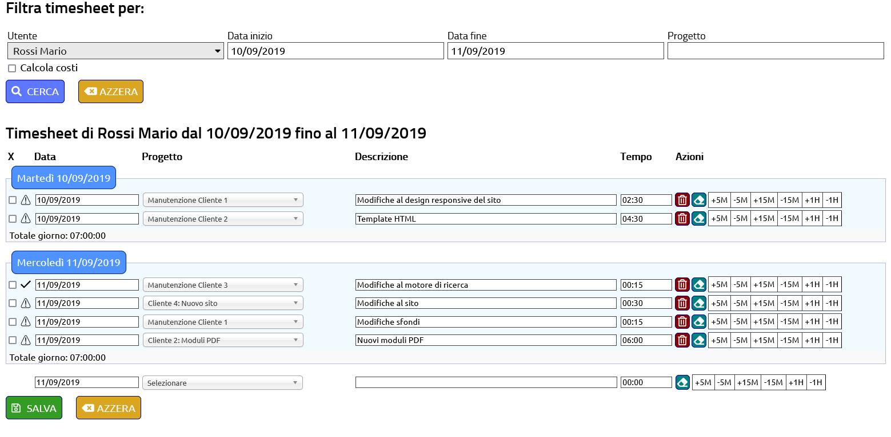

# differentTimesheet
 PHP experimental Timesheet software (not ready to deploy)

# Warning
This software is not ready to deploy. It is in an experimental state as a personal project and I want to share it to allow others to have a look on how a PHP Timesheet can be made.
The language used in coding is mainly Italian because I initially started this back in 2018 as an internal project and didn't plan to share it as FOSS at first.

This can be included in differentCRM to have a CRM and Timesheet software together.

# Preview screenshot
A screenshot to display how the Timesheet looks like

